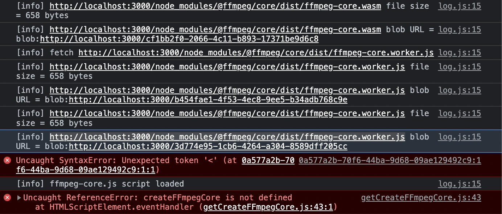
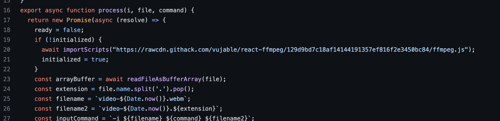

## 🔥 문제 발생

FFmpeg 사용중 아래와 같은 에러가 찍혔다.



## 분석

에러를 살펴보면 FFmpeg를 생성할때 localhost:3000 이후 경로에서 ffmpeg-core 관련된 파일을 찾는 도중 전부다 index.html 파일로 혼동하고 있는 것 같다.

```js
// src/pages/upload.tsx
const ffmpeg = createFFmpeg({
  log: true,
  corePath: "FFmpeg 코어파일 경로",
});
```

위 코드에서 corePath라는 인자를 받아 FFmpeg의 코어를 불러오는데 core를 import 시켜 가져오는게 아닌 코어 파일의 "경로"를 인자로 취하기 때문에 코어파일이 static파일 폴더에 있지 않으면 파일을 찾을 수 없는 것이다.(위 에러는 corePath의 default 값임)

## 해결방법 1

node_modules/@ffmpeg/core/dist 파일을 리액트 내부의 public 폴더에 복사하여 해당 경로를 corePath에 넣어준다.

## 해결방법 2

corePath를 unpkg.com(npm 패키지를 올려둔 cdn 서비스)에서 ffmpeg-core파일을 불러온다.

```js
const ffmpeg = createFFmpeg({
  log: true,
  corePath: "https://unpkg.com/@ffmpeg/core@0.10.0/dist/ffmpeg-core.js",
});
```

## 마치며

위 문제는 ffmpeg를 react나 next에서 사용할때 발생하는 문제인데 react-ffmpeg를 이용해도 된다.
(아래는 react-ffmpeg 코드인데 react-ffmpeg도 내부에 ffmpeg-core 파일을 내부에 복사하여 github cdn을 이용하여 복사한 코어 파일을 가져오고 있다.)



```

```
